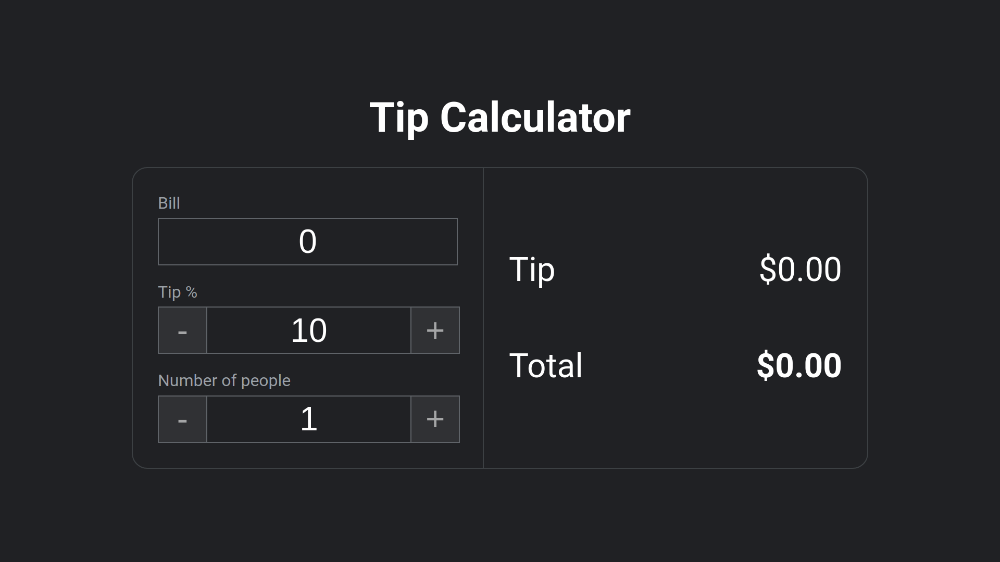

# Tip_Calculator_JS

## What is this ?
> This is a tip calculator website created by using ReactJs
>
> 

---

## How to download the project

> Clone the repository
> ```bash
> git clone https://github.com/AdithyanA2005/Tip_Calculator_ReactJS
> ```

> Install the dependencies
> ```bash
> yarn install
> ```

> Move Into the downloaded folder
> ```bash
> cd <FOLDER_NAME>
> ```

> Start the developement server
> ```bash
> yarn start
> ```
